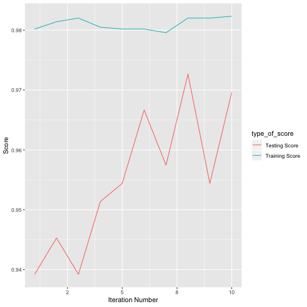

## Introduction

The Human Activity recognition dataset consists of information collected from embedded accelerometer and gyroscopes while performing tasks like WALKING, WALKING_UPSTAIRS, WALKING_DOWNSTAIRS, SITTING, STANDING and LAYING.The experiments have been carried out with a group of 30 volunteers within an age bracket of 19-48 years, with video evidence so as to label the observations correctly. The measure ments result in a 561 feature vector.


## Aim of this project

The aim of this project to effectively predict the activities using the given measurements via multinomial logistic regression as the predicting algorithm.


## Multinomial Logistic Regression

Multinomial logistic regression is a classification algorithm that generalizes the logistic regression method to predict more than two classes given the independent variables. This method is useful in cases where the dependent variable( the classes that we are trying to predict) are nominal in nature. This means that there is no rank associated with the classes. Examples of such include; What would a student choose as an elective given his/her preferences?


### Assumptions of Multi Nomial Logistic Regression


* Collinearity amongst the independent variables are assumed to be low
* Independence of Irrelevant Alternatives: The odds of prefering one class over the other do not depend on the presence or absence of other 'irrelevant' alternatives. For example, the relative probabilities of taking History against Geography is not affected by the introduction of Political Science.


### Process

One of the class outcomes is chosen as the pivot and the rest of the classes are modeled against this pivot class.In this example we will take the class 'SITTING' as the base class.


## Data and library load


```r
libraries_needed <- c('tidyr','dplyr','ggplot2','caret','purrr','rlang','hrbrthemes','GGally','caret')
lapply(libraries_needed ,require,character.only=TRUE)
data_raw<- read.csv('train.csv')
```
### Top Level Information

#### Number of columns and rows


```r
dim(data_raw)
```

```
## [1] 3609  563
```
The data has 563 features and 3609 observations.


#### Activities that are present


```r
data_raw %>%
  group_by(activity) %>%
  summarise(Frequency=n())
```

```
## # A tibble: 6 x 2
##   activity           Frequency
##   <fct>                  <int>
## 1 LAYING                   681
## 2 SITTING                  623
## 3 STANDING                 668
## 4 WALKING                  603
## 5 WALKING_DOWNSTAIRS       493
## 6 WALKING_UPSTAIRS         541
```

* There are 6 activities in total. 
* The frequencies of occurrences are not too skewed to a single activity.


## Looking at the variables
 

###  How does each variable impact the dependent variable that describes the activities?

*One Way ANOVA Test*

Given that we have 561 features in the dataset, we need to reduce the number of features that we need so as to simplify the model. One way to do that is to use the one way ANOVA(Analysis of Variance) Test. This is a technique used to identify if the difference in means between groups is significant or not by looking at the ratio of between group and within group variability. The null hypothesis of this test suggests that there is no significant difference between the means amongst the groups. And the alternate hypothesis suggests that at least one group's mean is significantly not similar to the other.

To run this test, we use each feature as the numerical vector and we will test this against the classes(groups). The features for which we get a p-value of less than 0.05 will be used in the model.


```r
list_of_variables <- data_raw %>% select(-rn,-activity) %>% names()
p_values_variables <- data.frame(variable_names=as.character(),p_values=as.numeric())
for(variable_names in list_of_variables){
  
  
  
  ### Grand Mean
  mean_grand <- data_raw %>% 
    select_(variable_names) %>% 
    mutate_all(funs(mean(.,na.rm=T))) %>% 
    unique() %>% 
    pull()
  
  
  ### Data frame with Number of Observations within each class and mean of observations per class
  mean_groups <- data_raw %>% 
    select_(variable_names ,'activity') %>% 
    group_by(activity) %>%
    summarise_all(funs(mean(.,na.rm=T))) %>% 
    inner_join(data_raw %>% select_(variable_names ,'activity') %>% group_by(activity) %>%
    summarise(n=n())) %>% ungroup() %>% as.data.frame()
  
  
  ## Rename the variable_names column as num_var . This is the within group mean
  mean_groups$num_var <- mean_groups[,variable_names]
  mean_groups <- mean_groups %>% 
    select(activity,num_var,n)
  
  ### Calculate The mean_sum_of_squares_between
  mean_sum_of_squares_between <- mean_groups %>%
    mutate(between_components = n * ((num_var - mean_grand) ^ 2)) %>% mutate(mean_squared_between =
    sum(between_components) / (length(unique(
    mean_groups$activity
    )) - 1)) %>%
    select(mean_squared_between) %>% unique() %>% pull()
  
  ### Within group variablility calculation
  mean_sum_of_squares_within <- data_raw %>% 
    select_(variable_names ,'activity') %>%
    inner_join(mean_groups) %>%
    mutate(within_components= (num_var-UQ(rlang::sym(variable_names)))^2) %>%
    mutate(mean_sum_of_squares= sum(within_components)/(nrow(data_raw)-length(unique(mean_groups$activity)))) %>%
    select(mean_sum_of_squares) %>% unique() %>% pull()
  
    #### F Statistic which between variability/within variability
    f_stat <- mean_sum_of_squares_between/mean_sum_of_squares_within
    ## p - value using this F statistic
    p_value <- pf(f_stat,(length(unique(
    mean_groups$activity
    )) - 1),(nrow(data_raw)-length(unique(mean_groups$activity))),lower.tail = F)
    
    if(p_value<0.05){
      
      p_value_df <- data.frame(variable_names=variable_names,p_values = p_value)
      p_values_variables <- rbind(p_value_df,p_values_variables)
      
    }
    
    
}
```

```
## Warning: package 'bindrcpp' was built under R version 3.4.4
```

```r
print(dim(p_values_variables))
```

```
## [1] 555   2
```


Out of 561 features, 555 features had a significant impact on the class variables.

### How do these variables interact with each other?

Before we feed the features into the logistic model, we need to make sure that the features are not collinear to each other. We will look at the number of variables each feature is correlated to. 


```r
columns_to_select <- p_values_variables %>%
  tidyr::spread(variable_names,p_values)
columns_to_select <- names(columns_to_select)

correlation_df <- data_raw %>% 
  select_(.dots=columns_to_select)
  
correlation_df <- correlation_df %>%
  cor() %>%
  as.data.frame()


correlation_df$row_names <- names(correlation_df)

number_of_variables  <- data.frame(variable_name=as.character(),number_of_variables=as.numeric())
for(col in names(correlation_df)[!grepl('row_names',names(correlation_df))]){
  col <- as.character(col)
  row_to_check <- correlation_df %>%
    select(UQ(rlang::sym(col)),row_names) %>%
    filter(abs(UQ(sym(col)))>0.5) %>% select(row_names) %>% filter(row_names!=col) %>% pull()
  number_of_variables <- rbind(number_of_variables,data.frame(variable_name=col,number_of_variables=length(row_to_check)))
    
  
}
variables_needed_for_modeling <- number_of_variables %>%
  filter(number_of_variables==0) %>% select(variable_name) %>% pull()

print(variables_needed_for_modeling)
```

```
##  [1] fBodyBodyGyroJerkMag.maxInds  fBodyBodyGyroMag.maxInds     
##  [3] fBodyBodyAccJerkMag.maxInds   fBodyGyro.maxInds.Z          
##  [5] fBodyGyro.maxInds.Y           fBodyGyro.maxInds.X          
##  [7] fBodyAcc.maxInds.Z            fBodyAcc.maxInds.X           
##  [9] tBodyGyroJerk.correlation.X.Z tBodyGyroJerk.correlation.X.Y
## [11] tBodyGyroJerk.arCoeff.Z.4     tBodyGyroJerk.arCoeff.Y.4    
## [13] tBodyGyroJerk.arCoeff.X.4     tBodyGyro.correlation.X.Z    
## [15] tBodyGyro.correlation.X.Y     tBodyGyro.mean.Z             
## [17] tBodyAccJerk.correlation.X.Z  tBodyAccJerk.correlation.X.Y 
## [19] tBodyAccJerk.arCoeff.Z.4      tBodyAccJerk.arCoeff.Y.4     
## [21] tGravityAcc.correlation.X.Z   tGravityAcc.correlation.X.Y  
## [23] tGravityAcc.entropy.Z         tGravityAcc.entropy.Y        
## [25] tBodyAcc.correlation.X.Z      tBodyAcc.correlation.X.Y     
## [27] tBodyAcc.mean.Z               tBodyAcc.mean.Y              
## 555 Levels: angle.Z.gravityMean angle.Y.gravityMean ... tBodyAcc.mean.X
```


Out of 555 variables, 28 variables are not correlated to any other variable in the data set.


### Visualizing the correlation matrix


*We use a correlational plot to confirm low correlation amongst variables*


```r
modeling_data <- data_raw %>%
  select_(.dots=dput(as.character(variables_needed_for_modeling)),'activity')
```

```
## c("fBodyBodyGyroJerkMag.maxInds", "fBodyBodyGyroMag.maxInds", 
## "fBodyBodyAccJerkMag.maxInds", "fBodyGyro.maxInds.Z", "fBodyGyro.maxInds.Y", 
## "fBodyGyro.maxInds.X", "fBodyAcc.maxInds.Z", "fBodyAcc.maxInds.X", 
## "tBodyGyroJerk.correlation.X.Z", "tBodyGyroJerk.correlation.X.Y", 
## "tBodyGyroJerk.arCoeff.Z.4", "tBodyGyroJerk.arCoeff.Y.4", "tBodyGyroJerk.arCoeff.X.4", 
## "tBodyGyro.correlation.X.Z", "tBodyGyro.correlation.X.Y", "tBodyGyro.mean.Z", 
## "tBodyAccJerk.correlation.X.Z", "tBodyAccJerk.correlation.X.Y", 
## "tBodyAccJerk.arCoeff.Z.4", "tBodyAccJerk.arCoeff.Y.4", "tGravityAcc.correlation.X.Z", 
## "tGravityAcc.correlation.X.Y", "tGravityAcc.entropy.Z", "tGravityAcc.entropy.Y", 
## "tBodyAcc.correlation.X.Z", "tBodyAcc.correlation.X.Y", "tBodyAcc.mean.Z", 
## "tBodyAcc.mean.Y")
```

```r
modeling_data %>%
  select(-activity) %>%
  cor() %>%
  corrplot::corrplot(method = 'circle',tl.pos='n')
```


### Building a multi class logistic regression

We will then feed the variables into the multi nomial logistic regression function to predict the activities.


```r
library(nnet)
modeling_data$activity <- relevel(modeling_data$activity,ref='SITTING')

model_logistic <- multinom(activity~.,data=modeling_data)
broom::tidy(model_logistic)


test <- predict(model_logistic,data=modeling_data %>% select(-activity))


real_pred <- data.frame(real=modeling_data$activity,test=as.character(test))
caret::confusionMatrix(real_pred$real,real_pred$test)
```

```
## Warning in confusionMatrix.default(real_pred$real, real_pred$test): Levels
## are not in the same order for reference and data. Refactoring data to
## match.
```

* Even though the model has an accuracy of 67%, it was able to predict only 56% of the entries marked `SITTING` correctly.


The model above is trained on the entire dataset. One disadvantage of doing this is the inability to assess how the model would perform with new data. To counter this we follow the K Folds cross validation procedure.

### Cross Validation

The dataset is split into ten equal parts and in each iteration one part is used as the test data while the rest of the data is used as the training dataset.


```r
## Implementing cv from scratch

## shuffle the data
set.seed(42)
scaleFUN <- function(x) sprintf("%.f", x)

random_data <- dplyr::slice(modeling_data,sample(1:n()))
test_idx <- round(seq(1,nrow(modeling_data),by=nrow(modeling_data)/11))
accuracy_df <- data.frame(iteration= as.numeric(),accruacy_score= as.numeric())
for(i in 1:10){
  
  test_data <- slice(random_data,test_idx[i]:test_idx[i+1])
  train_data <- slice(random_data,-test_idx[i]:-test_idx[i+1])
  model_cv <- multinom(activity~.,data=train_data)
  predict_cv <- as.character(predict(model_cv,newdata=test_data %>% select(-activity)))
  accuracy_score <- sum(as.character(predict_cv)==as.character(test_data$activity))/nrow(test_data)
  accuracy_df <- rbind(accuracy_df,data.frame(iteration=i,accuracy_score=accuracy_score))
  
  

  
  
  
  
  
}
```

```
## # weights:  180 (145 variable)
## initial  value 5876.971059 
## iter  10 value 4083.459019
## iter  20 value 3398.974428
## iter  30 value 3135.504723
## iter  40 value 3080.665825
## iter  50 value 3069.892636
## iter  60 value 3067.665882
## iter  70 value 3067.068524
## iter  80 value 3066.983665
## iter  90 value 3066.966476
## final  value 3066.966322 
## converged
## # weights:  180 (145 variable)
## initial  value 5876.971059 
## iter  10 value 4158.195157
## iter  20 value 3439.631476
## iter  30 value 3133.630965
## iter  40 value 3094.146446
## iter  50 value 3083.933502
## iter  60 value 3081.330817
## iter  70 value 3080.882864
## iter  80 value 3080.708476
## iter  90 value 3080.687243
## final  value 3080.686901 
## converged
## # weights:  180 (145 variable)
## initial  value 5876.971059 
## iter  10 value 4003.293026
## iter  20 value 3426.307705
## iter  30 value 3117.754028
## iter  40 value 3082.044787
## iter  50 value 3072.437181
## iter  60 value 3070.150008
## iter  70 value 3069.773038
## iter  80 value 3069.683738
## iter  90 value 3069.666782
## final  value 3069.666350 
## converged
## # weights:  180 (145 variable)
## initial  value 5876.971059 
## iter  10 value 4011.846880
## iter  20 value 3528.326437
## iter  30 value 3145.213840
## iter  40 value 3093.265447
## iter  50 value 3087.350882
## iter  60 value 3086.127236
## iter  70 value 3085.827171
## iter  80 value 3085.749878
## iter  90 value 3085.734761
## final  value 3085.734517 
## converged
## # weights:  180 (145 variable)
## initial  value 5876.971059 
## iter  10 value 4010.944433
## iter  20 value 3363.587528
## iter  30 value 3167.592560
## iter  40 value 3122.612345
## iter  50 value 3113.631579
## iter  60 value 3111.844480
## iter  70 value 3111.436166
## iter  80 value 3111.357186
## iter  90 value 3111.339863
## final  value 3111.339733 
## converged
## # weights:  180 (145 variable)
## initial  value 5875.179300 
## iter  10 value 4091.555455
## iter  20 value 3453.614522
## iter  30 value 3152.246738
## iter  40 value 3101.432092
## iter  50 value 3090.778506
## iter  60 value 3088.520816
## iter  70 value 3088.015527
## iter  80 value 3087.944083
## iter  90 value 3087.931043
## final  value 3087.930745 
## converged
## # weights:  180 (145 variable)
## initial  value 5876.971059 
## iter  10 value 4235.657197
## iter  20 value 3418.611433
## iter  30 value 3135.502016
## iter  40 value 3077.125813
## iter  50 value 3066.062572
## iter  60 value 3063.076877
## iter  70 value 3062.567934
## iter  80 value 3062.490314
## iter  90 value 3062.477768
## final  value 3062.477268 
## converged
## # weights:  180 (145 variable)
## initial  value 5876.971059 
## iter  10 value 4466.702891
## iter  20 value 3609.828341
## iter  30 value 3190.278834
## iter  40 value 3134.156199
## iter  50 value 3122.428228
## iter  60 value 3120.588882
## iter  70 value 3119.844619
## iter  80 value 3119.639514
## iter  90 value 3119.600687
## final  value 3119.600430 
## converged
## # weights:  180 (145 variable)
## initial  value 5876.971059 
## iter  10 value 4120.156138
## iter  20 value 3505.968732
## iter  30 value 3164.447650
## iter  40 value 3111.589308
## iter  50 value 3100.634704
## iter  60 value 3098.793257
## iter  70 value 3098.263141
## iter  80 value 3098.160288
## iter  90 value 3098.139985
## final  value 3098.139716 
## converged
## # weights:  180 (145 variable)
## initial  value 5876.971059 
## iter  10 value 4010.962358
## iter  20 value 3455.439461
## iter  30 value 3116.418372
## iter  40 value 3074.325763
## iter  50 value 3064.547428
## iter  60 value 3063.028891
## iter  70 value 3062.566686
## iter  80 value 3062.355885
## iter  90 value 3062.331823
## final  value 3062.331181 
## converged
```

```r
accuracy_df %>%
  ggplot(aes(x=iteration,y=accuracy_score))+
  geom_line()+labs(x='Iteration Number',y='Accuracy Score',title='Accuracy Scores for each Iteration')+
  scale_x_continuous(labels = scaleFUN)+
  theme(plot.title = element_text(hjust=0.5))+
  geom_point()
```




## Interpreting the model

The coefficients that we get with the multinom() function is the increase in relative odds of an event happening against the base event with unit increase in the given variable.


```r
coeff_data <- broom::tidy(summary(model_logistic)$coefficients)

coeff_data_long <- coeff_data %>%
  gather(variable,increase_in_log_odds,3:ncol(coeff_data)) 

coeff_data_long %>%
  select(.rownames,variable,increase_in_log_odds) %>%
  mutate(pos = ifelse(increase_in_log_odds>0,'Positive','Negative')) %>%
  ggplot(aes(x=variable,y=increase_in_log_odds,fill=pos))+
  geom_bar(stat='identity',width=0.4,position = position_dodge(width=0.5))+
  facet_wrap(~.rownames,nrow=5)+
  theme(axis.text.x=element_text(size=7,angle = 90),axis.text.y = element_blank(),panel.background = element_blank(),axis.ticks.y = element_blank(),
        legend.title = element_blank())+
  labs(x='Variable',y='Increase in Log Odds')
```


The above plot is a visualization of the positive and negative coefficients of the model . Let's look at the positive and negative coefficients separately.


### Positive coefficients


```r
coeff_data_long %>%
  filter(increase_in_log_odds>0) %>%
  select(.rownames,variable,increase_in_log_odds) %>%
  ggplot(aes(x=variable,y=increase_in_log_odds))+
  geom_bar(stat='identity',width=0.4,position = position_dodge(width=0.5),fill='#cdcdb4')+
  facet_wrap(~.rownames,nrow=5)+
  theme(axis.text.x=element_text(size=7,angle = 90),axis.text.y = element_blank(),panel.background = element_blank(),axis.ticks.y = element_blank())+
  labs(x='Variable',y='Increase in Log Odds')
```


Key take aways
* The variable `fBodyBodyGyroMag.maxInds` is essential to the characteristics of walking. A unit increase in this measure results in a significant increase in log odds of walking against sitting(baseline). 

* The variable `tBodyAcc.correlation.X.Y`'s positive values are indicative of non motion. Unit increase in this variable correspond to increase in probability  of `LAYING` and `STANDING`.
* Positive values of `tBodyGyroJerk.arCoeff.Z.4 ` correspond to non motion.

* `fBodyBodyGyroJerkMag.maxInds` is indicative of motion related activity as seen by the positive values for `WALKING_UPSTAIRS`,`WALKING_DOWNSTAIRS` AND `WALKING`.

### Negative coefficients


```r
coeff_data_long %>%
  filter(increase_in_log_odds<0) %>%
  select(.rownames,variable,increase_in_log_odds) %>%
  ggplot(aes(x=variable,y=increase_in_log_odds))+
  geom_bar(stat='identity',width=0.4,position = position_dodge(width=0.5),fill='#b0585b')+
  facet_wrap(~.rownames,nrow=5)+
  theme(axis.text.x=element_text(size=7,angle = 90),axis.text.y = element_blank(),panel.background = element_blank(),axis.ticks.y = element_blank())+
  labs(x='Variable',y='Increase in Log Odds')
```


Key take aways
* `fBodyBodyGyroJerkMag.maxInds` was established as a motion related variable in the previous section. This hypothesis is further confirmed by negative values for activities that are stationary.

* The variable `tBodyAcc.correlation.X.Y`'s negative values during motion related activity indicates decrease in log odds against `SITTING`.This again confirms our hypothesis of `tBodyAcc.correlation.X.Y` being a variable that is related to staionarity .

* Negative values of `tBodyGyroJerk.arCoeff.Z.4 ` indicate decrease in the log odds ratio against sitting. This means that the unit increase in this variable will highly likely correspond to non motion.


Final Results


* `fBodyBodyGyroJerkMag.maxInds` ,``tBodyAcc.correlation.X.Y`,`tBodyGyroJerk.arCoeff.Z.4 ` and  `fBodyBodyGyroMag.maxInds` can be used to differentiate between walking and being stationary.

A closer look confirms the existence of this demarcation.


```r
coeff_data_long %>%
  select(.rownames,variable,increase_in_log_odds) %>%
  filter(variable %in% c('fBodyBodyGyroJerkMag.maxInds','tBodyAcc.correlation.X.Y','tBodyGyroJerk.arCoeff.Z.4','fBodyBodyGyroMag.maxInds')) %>%
  mutate(pos = ifelse(increase_in_log_odds>=0,'Positive','Negative')) %>%
  ggplot(aes(x=variable,y=increase_in_log_odds,fill=pos))+
  geom_bar(stat='identity',width=0.4,position = position_dodge(width=0.5))+
  facet_wrap(~.rownames,nrow=5)+
  theme(axis.text.x=element_text(size=7,angle = 90),axis.text.y = element_blank(),panel.background = element_blank(),axis.ticks.y = element_blank())+
  labs(x='Variable',y='Increase in Log Odds')
```


